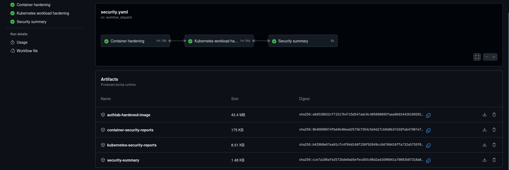
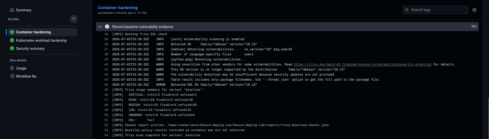
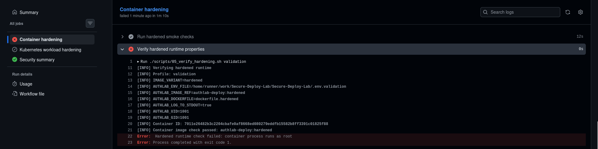
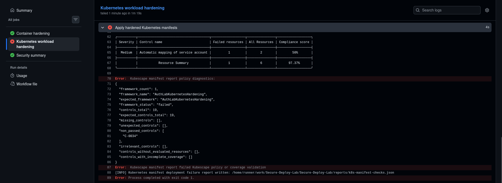
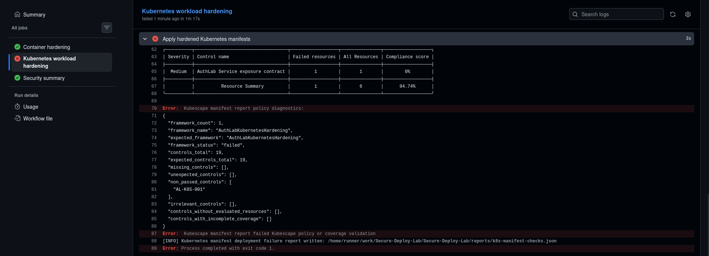
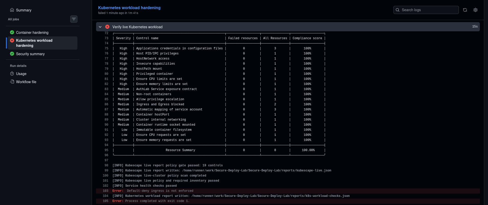

# Security pipeline red/green demo

## 1. Purpose

This document demonstrates how the repository validation pipeline behaves in representative green, non-blocking, and red scenarios.

---

## 2. Demo scope

This document includes:

* a green baseline run
* representative blocking scenarios tied to the project policy
* baseline evidence-only behavior where vulnerability findings are recorded but do not block

It is not an exhaustive catalog of every possible failure mode.

---

## 3. Green baseline

A manual `workflow_dispatch` run on `main` was used as the baseline green case.

This demonstrates that the reviewed repository state passes the full container and Kubernetes validation pipeline and produces the expected report set.



---

## 4. Non-blocking scenario

### 4.1 Baseline vulnerability evidence

For this demo case, the baseline Dockerfile was temporarily adapted to build
from an EOL Debian 10 image. Its obsolete package sources were redirected to
the Debian archive so the existing package-refresh step could complete.

```diff
- FROM python:3.13-slim
+ FROM python:3.10-slim-buster

-RUN apt-get update \
+RUN sed -i \
+        -e 's|http://deb.debian.org/debian|http://archive.debian.org/debian|g' \
+        -e 's|http://security.debian.org/debian-security|http://archive.debian.org/debian-security|g' \
+        /etc/apt/sources.list \
+    && apt-get -o Acquire::Check-Valid-Until=false update \
     && apt-get upgrade -y \
     && rm -rf /var/lib/apt/lists/*
```

This demonstrates that the baseline Trivy scan records the detected EOL
condition as evidence without blocking the workflow. Baseline runtime smoke
checks remain blocking.




---

## 5. Red scenarios

The red scenarios below show representative blocking behavior when a validation stage detects a policy-violating condition.

### 5.1 Red: hardened runtime blocking

For this demo case, the Compose service was temporarily configured to override the image user with the root UID and GID.

```diff
    build:
      context: .
      dockerfile: ${AUTHLAB_DOCKERFILE:-dockerfile.baseline}
      args:
        AUTHLAB_UID: ${AUTHLAB_UID:-1000}
        AUTHLAB_GID: ${AUTHLAB_GID:-1000}
+   user: "0:0"    
    ports:
      - "127.0.0.1:5000:5000"

```

This demonstrates that successful image build and runtime smoke checks are not sufficient when the running hardened container violates the non-root execution
contract.



### 5.2 Red: Kubescape workload-control blocking

For this demo case, automatic ServiceAccount token mounting was temporarily enabled in the AuthLab Pod template.

```diff
    spec:
      serviceAccountName: authlab
-      automountServiceAccountToken: false
+      automountServiceAccountToken: true
```

This demonstrates that the static Kubernetes stage blocks when the workload is allowed to receive cluster credentials that it does not require.



### 5.3 Red: Service exposure contract blocking

For this demo case, the AuthLab Service was temporarily changed from the required internal `ClusterIP` type to `NodePort`.

```diff
spec:
  type: ClusterIP
+ type: NodePort
```

This demonstrates that the project-specific `AL-K8S-001` control blocks an unexpected Service exposure model before the manifests are applied.



### 5.4 Red: NetworkPolicy runtime blocking

For this demo case, the default-deny NetworkPolicy was temporarily changed to allow all ingress traffic while retaining both policy types.


```diff
spec:
  podSelector: {}
  policyTypes:
    - Ingress
    - Egress
+ ingress:
+   - {}
```

This demonstrates that passing structural policy validation is not treated as proof of network isolation. The live workload stage blocks when the expected
default-deny ingress behavior is not enforced by the running cluster.


